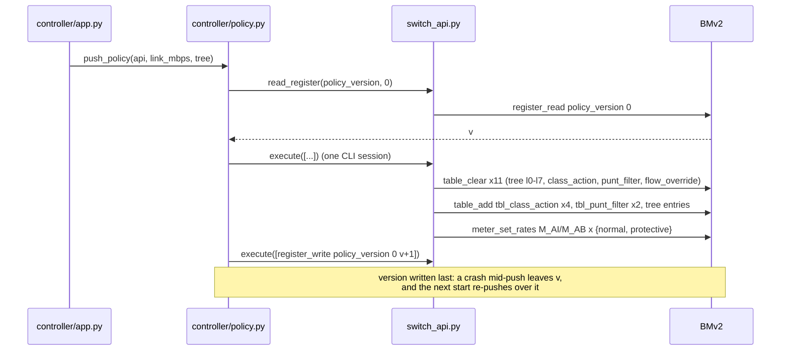
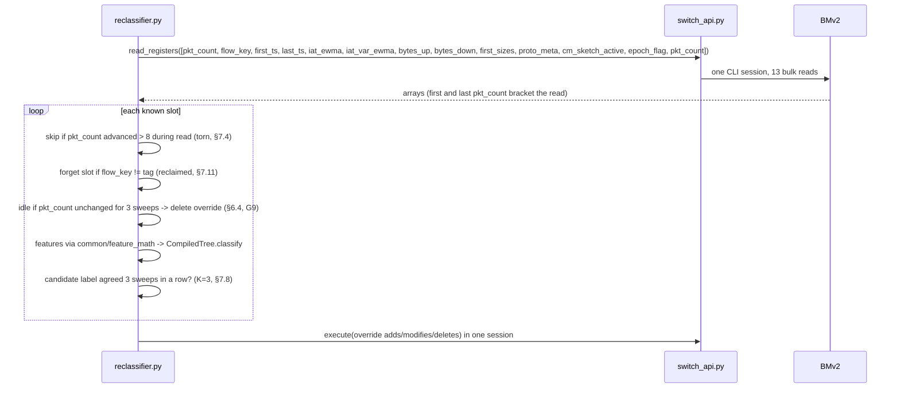

# Controller Design: Startup, Punt Path, Reclassifier (task P2.3)

Implements design.md §6.1–6.4 under the race/edge rules of §7.4–7.8, §7.10–7.11. Every switch
interaction goes through `controller/switch_api.py`. One operation equals one `simple_switch_CLI`
session (commands batched over stdin), because each CLI start costs about 0.5 s. Shared constants
come from `common/contracts.py`, and feature arithmetic comes from `common/feature_math.py`.

The controller runs in the Python 3.9 Ryu venv and imports nothing from `ml/`. It evaluates the
compiled tree through `common/compiled_tree.py` instead of sklearn. The §7.9 equivalence gate
proves the two agree.

## 1. Startup push (§6.1, §7.5)



- Every start pushes the full policy (G5). Clearing before adding makes a re-push idempotent, so
  BMv2 never returns `DUPLICATE_ENTRY`.
- While the clear-and-add runs, tree tables may briefly be empty and flows classify UNKNOWN. That
  is fail-open and lasts about one CLI session.
- `tbl_flow_override` is cleared because the TTL bookkeeping that owned it died with the previous
  process. The tree stays authoritative.

## 2. Punt path (§6.2, §7.6)

```mermaid
sequenceDiagram
    participant SW as BMv2 (clone to CPU port)
    participant Rx as punt reader (AF_PACKET)
    participant Q as bounded queue
    participant PH as punt_handler.py
    participant API as switch_api.py
    SW->>Rx: cpu_header(8 B) + original frame
    Rx->>Q: put_nowait (full -> drop + count, §7.6)
    Q->>PH: frame
    PH->>PH: parse cpu_header -> slot, class, reason, port
    PH->>PH: parse Eth/IPv4/TCP -> canonical 5-tuple, tag = flow_tag(key)
    alt reason 1 (TLS ClientHello)
        PH->>PH: ja4(client_hello); WBA verify if HTTP visible (G12)
    end
    PH->>PH: remember slot -> (5-tuple, tag, evidence)
    opt evidence says non-browser / signed agent
        PH->>API: override upsert (5-tuple -> AGENT_INTERACTIVE) by known handle
    end
```

- Punts are refinements: losing one never affects correctness.
- The data-plane punt meter caps the rate. The controller queue adds a second, bounded line of
  defence.
- The slot → 5-tuple map is the controller's only way to name a flow (G8). A slot is trusted only
  while `reg_flow_key[slot] == flow_tag(key)`.
- Evidence overrides (JA4/WBA) persist until the flow ages out. The reclassifier does not touch
  them (G11).

## 3. Sweep every 2 s (§6.3, §6.4, §7.4, §7.8, §7.10, §7.11)



**Epoch tick (every 1 s, §7.10):** write `reg_epoch_flag := 1 − flag`. On the **next** tick, run
`register_reset` on the retired sketch, so packets in flight during the flip have settled first.

**Budget check (VM, before P3.11):** time one 13 × 65536 bulk-read session. If it takes more than
1.5 s of the 2 s period, move the sweep to the BMv2 Thrift Python client (`bm_runtime`). That is a
design change to raise at sync.

## 4. Decisions to confirm at sync

| # | Decision |
|---|---|
| G5 | No "expected" version exists: every start re-pushes idempotently and writes version+1 last |
| G6 | The controller is a plain Python process; Ryu's OpenFlow loop has no role with BMv2 Thrift |
| G7 | The reclassifier evaluates `compiled_tree.json`, not sklearn (no sklearn in the 3.9 venv) |
| G8 | The sweep reads every feature register; only punt-learned, tag-validated slots are acted on |
| G9 | Idle = `pkt_count` unchanged for `ceil(IDLE_TIMEOUT / T)` = 3 sweeps (no switch clock needed) |
| G10 | Torn-read guard threshold = 8 packets |
| G11 | Evidence overrides are sticky until aging; the reclassifier manages non-evidence flows only |
| G12 | WBA needs Ed25519 (`cryptography` sign-off); Dev A punts the first plaintext-HTTP payload |
| G15 | Leaves with purity < 0.85 compile to `tree_leaf(UNKNOWN, punt_reason=2)` |

The punt CPU-port interface name comes from `harness/topology.py` and must be agreed with Dev C.
